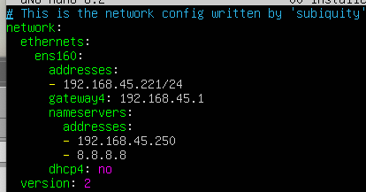

# Linux: Config và Scripts

Ubuntu version 22.04

Muốn tìm hiểu học bashscript linux thì trước cần nắm rõ một số lệnh thường dùng của linux


## 1.Network config: Netplan


Old config truớc 22.04. Từ version 22.04 trở đi dùng config này sẽ gây lỗi

Netplan configuration example cho version 22.04:
file: ./netplan/00-installer-config.yaml
Config apply:

```
  $: netplan apply
```

- **P/S:**
  - File `/netplan/00-installer-config.yaml` chỉ nên giới hạn với permision 600
  - Tôi từng gặp lỗi khá khó chịu khi Terraform không tạo được VM do config của netplan không đúng.
## 2. Config allow user use sudo no passwod:
EX: I have a user is: nexroot
```
sudo visudo
```
add new permission for this user
```
nexroot ALL=(ALL) NOPASSWD:ALL
```
or set no password for group admin and add this user to admin group.

#### Tập hợp cách lệnh sử dụng trong linux và bài viết tìm hiểu cơ bản**

- Link lib command:  https://www.server-world.info/en/
- Link cơ bản shell và shell script: https://viblo.asia/p/gioi-thieu-ve-linux-shell-va-shell-script-aWj53LweK6m => Need to see more related articles

#### Học trên pluralsight: 

Link học search theo từ khoá:** [https://app.pluralsight.com/search/](https://app.pluralsight.com/search/?q=bash%20script%20linux&type=conference%2Cvideo-course%2Cguide%2Cpath&m_sort=relevance&query_id=1b16d49d-d967-49d2-812a-c4ac095e9eab&source=user_typed)

#### Một số task làm thành template:**
